% Mandatory Access Control in PostgreSQL - giving users ownership of their data
% Leon du Toit
% 2019-01-15

---
header-includes:
  - \hypersetup{colorlinks=false,
            allbordercolors={0 0 0},
            pdfborderstyle={/S/U/W 1}}
---

# Outline

* why take data ownership seriously?
* why Mandatory Access Control?
* a brief introduction to the `pg-need-to-know` module
* a use case to demostrate features:
    * For users: ownership, insight and consent-based usage
    * For administrators: fine-grained access control, audit information
    * For developers: a rich REST API, with a built-in authorization model
* optionally: a look at some implementation details

# Why take data ownership seriously?

* Regulations of [the GDPR](https://eugdpr.org/the-regulation/)
    * increased focus on data privacy and protection
    * right to access
    * right to be forgotten
    * data portability
    * consent-based data usage
    * increased demand for audit information
* Respecting people

# Why Mandatory Access Control?

* _enforcible_ policies, in constrast to Discretionary Access Control
* enables consent-based data access
* supports granular access needs

# pg-need-to-know

* PostgreSQL "module" - really just a set of tables, views, and functions
* implements Mandatory Access Control
* more limited approach than [SEPostgreSQL](https://wiki.postgresql.org/wiki/SEPostgreSQL_SELinux_Overview)
* source: https://github.com/leondutoit/pg-need-to-know
* written in [PL/pgSQL](https://www.postgresql.org/docs/current/plpgsql-overview.html)
    * procedural language, extending SQL with control structures
    * used to create functions
    * ~1000 sloc, another ~1500 for tests
* uses Row-Level Security policies to implement MAC
* designed to be used via a REST API

# Row-Level Security

* [Row-Level Security](https://www.postgresql.org/docs/current/static/ddl-rowsecurity.html) introduced in PostgreSQL 9.5
* policy expression evaluated during SQL query execution, for each row
* can use row values as input to functions or expressions specified in the policy
* if true then row returned, if false then not

# Security policies

[CREATE POLICY](https://www.postgresql.org/docs/11/sql-createpolicy.html):
```txt
CREATE POLICY name ON table_name
[ AS { PERMISSIVE | RESTRICTIVE } ]
[ FOR { ALL | SELECT | INSERT | UPDATE | DELETE } ]
[ TO { role_name | PUBLIC | CURRENT_USER | SESSION_USER } ]
[ USING ( using_expression ) ]
[ WITH CHECK ( check_expression ) ]
```

# Use case

Key terms:

* data owner: provides data about themselves
* data user:  analyses data about others
* admin: creates access control policies

# Use case

Assume the following setup:

* data owners: A, B, C, D, E, F
* data users: X, Y, Z
* tables: spending_habits, personal_details, containing data from all data owners

# Use case

Now suppose we need to set up the following access control rules in our DB:

* data users X, and Y should only have access to data in table spending_habits and only data from owners A, B, C, D
* data user Z should have access to all data - i.e. tables spending_habits, personal_details

# Use case

A hypothetical sequence of events using `pg-need-to-know`:

1. admin creates tables
2. data owners and data users register themselves, data is collected
3. admin creates groups, adds members, adds table grants
4. data is analysed
5. users manage their own data
6. admins get audit insights
7. developers create applications using these features

# Table creation

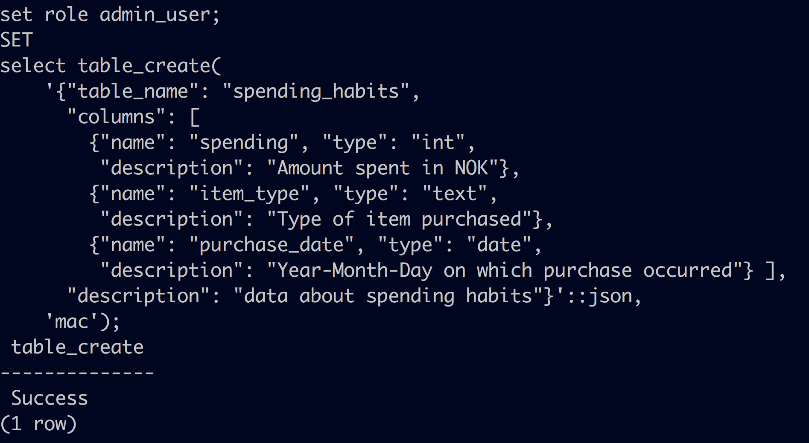

# User registration

* can require consent before user registration
* data collection not possible without registration

# Group setup, table grants

* can link consent(s) to groups via group metadata
* group1
    * members: ((X, Y), (A, B, C, D))
    * select table access grant: (spending_habits)
* group2
    * members: ((Z), (A, B, C, D, E, F))
    * select table access grants: (spending_habits, personal_details)

# Data analysis

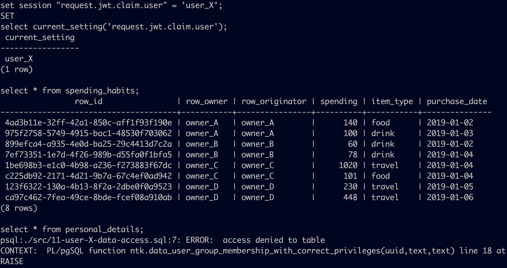

# Data analysis

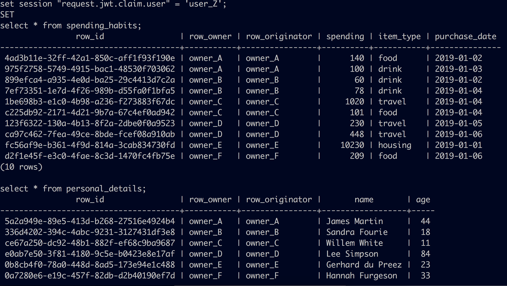

# Data ownership

* right to access
* data portability
* right to be forgotten

# Right to access

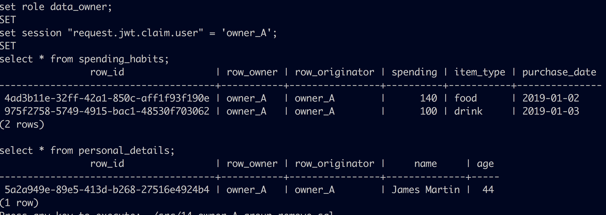

# Data portability

* owner A can simply download their data

# Right to be forgotten

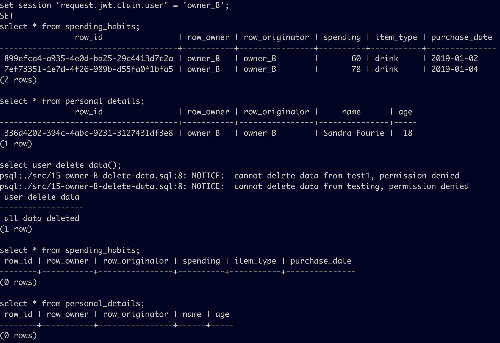

# Audit insights

* data access
* access control changes
* user initiated group removals
* user initiated data deletions
* data updates

# Audit: data access

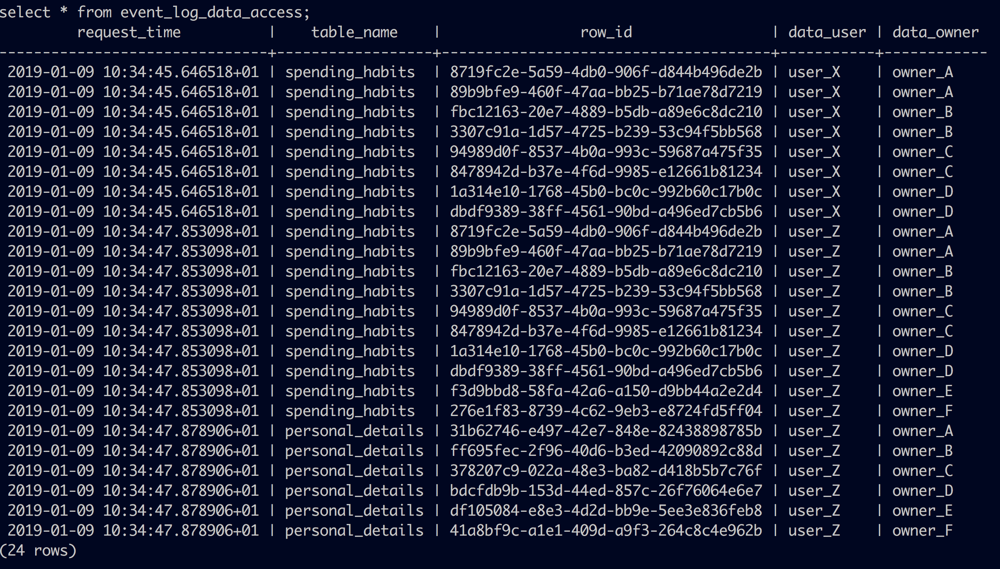

# Audit: access control changes

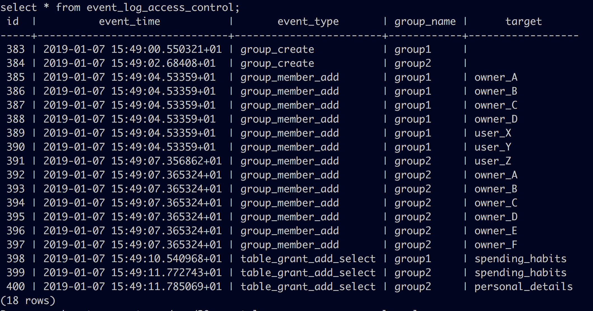

# Audit: user initiated group removals

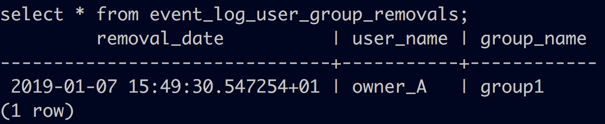

# Audit: user initiated data deletions

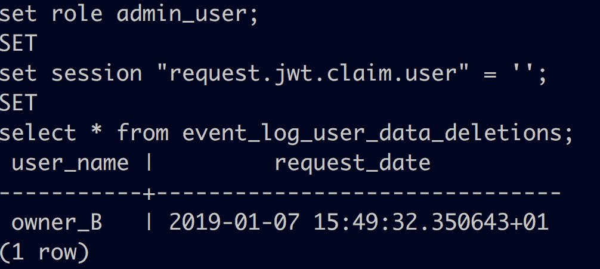

# Audit: data updates

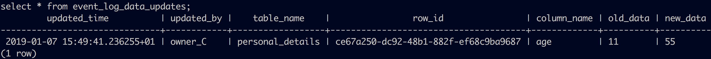

# Application development

Architecture:
```txt

webapp -> REST -> (pg-need-to-know, PostgresQL)

```
* developers can focus on business logic
* authorization taken care of
* authentication is left to the webapp implementor

# postgrest

* `pg-need-to-know` designed to be used with [postgrest](http://postgrest.org/en/v5.2/)
* open source project written in Haskell
* provides a REST API for any PostgreSQL DB
* https://github.com/leondutoit/pg-need-to-know/blob/master/api/http-api.md
* `pg-need-to-know` requires a custom compilation of this server due to audit logging
* available here: https://github.com/leondutoit/postgrest-need-to-know

# Authentication requirements

* webapp must provide an access token at request time
* a JWT with the following claims:
    * `exp: expiry time`
    * `role: <data_owner, data_user, admin_user>`
    * `user: user name`
* `pg-need-to-know` provides a `/token` endpoint for access token generation
* but developers can implement their own
* refernce client for HTTP API: https://github.com/leondutoit/py-need-to-know

# Implementation details

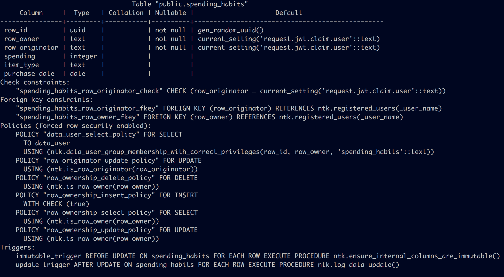

# More info

* watch a demo recording: https://asciinema.org/a/c3XIyrfnoLixofqiSbx8p0l21
* read the docs: https://github.com/leondutoit/pg-need-to-know/tree/master/docs
* this presentation, and materials: https://github.com/leondutoit/pg-ntk-demo
